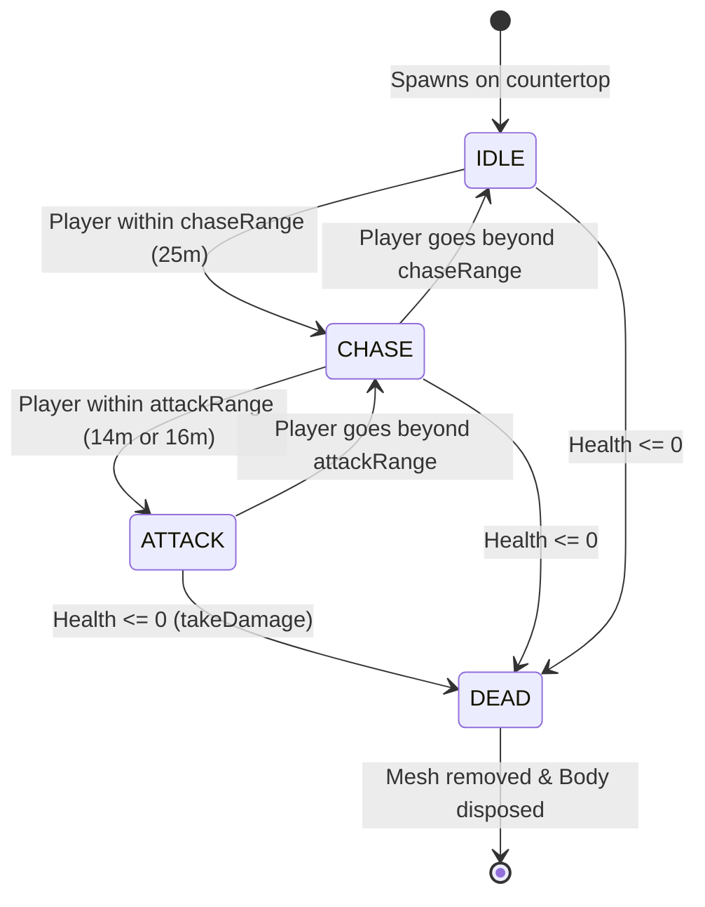

# NPC Engine: Architectural Design

This document details the architectural design, behavior FSM, and physics scaling of the hostile veggie enemies (Broccoli Boys and Carrot Cartel) in the Potato Gang Kitchen Arena.

---

## 🤖 1. Enemy Factions & Characteristics

Hostile NPCs are divided into two main syndicates:
1.  **Broccoli Boys (Green Faction)**: 
    *   **Visual Model**: Built by `src/render/models/BroccoliModel.js` — a brownish stalk (`CylinderGeometry`) topped by 3 deep green clustered spheres (`SphereGeometry`) and glowing red eyes. Shadow casting/receiving applied automatically via factory traverse.
    *   **Health**: `40` HP.
    *   **Movement**: Swift chasers (`speed = 4.5`). Charges the player directly.
    *   **Range**: Close combat fire (`attackRange = 14m`).
2.  **Carrot Cartel (Orange Faction)**:
    *   **Visual Model**: Built by `src/render/models/CarrotModel.js` — an elongated cone pointing downwards (`ConeGeometry`), leaf tops (`CylinderGeometry`), and white eyes with black pupils. Shadow traverse applied automatically.
    *   **Health**: `50` HP.
    *   **Movement**: Strategic snipers (`speed = 5.5`).
    *   **Range**: Extended sniper fire (`attackRange = 16m`).

> **Architecture Note**: All NPC mesh construction is delegated to standalone factory functions in `src/render/models/`. `NpcEngine.js` contains only FSM logic, physics behavior, and lifecycle management — never inline geometry or material code.

---

## 🔄 2. Finite State Machine (FSM) Logic

Every frame, the `NpcEngine` updates the states of all active NPCs:



### State Behaviors
*   **`IDLE`**: Spring-force hover to maintain ground height. Slowly drifts back to its original spawn point if displaced.
*   **`CHASE`**: Computes direction vector to player. Applies direct horizontal forces toward player while the hover spring maintains height. NPCs jump (single impulse + `hoverBypassTimer`) only when the player is significantly above (`heightDiff > 2.0`). If the player is airborne and the NPC is also airborne, a jetpack-style boost force is applied.
*   **`ATTACK`**: `linearDamping = 0.92` halts horizontal drift. Fires a projectile (tomato seed/orange dart) at the player according to its `fireRate` interval.
*   **`DEAD`**: Disposes of visual mesh, unregisters physics body, triggers juice splatters, and awards score/kills. The NpcEngine removes dead entries from `npcs[]` on the next `update()` tick.

---

## 🌌 3. Physics & Gravity Scaling

To maintain stable positioning under Earth gravity (`9.8 m/s²`), upward hover forces are computed dynamically using a PD spring model:

$$\text{UpwardForce} = \text{mass} \times \text{gravity} + (\text{heightError} \times k_p - \dot{y} \times k_d)$$

For an NPC with mass $15\,\text{kg}$ under Earth gravity ($9.8\,\text{m/s}^2$), the base gravity compensation is:
$$\text{GravityForce} = 15 \times 9.8 = 147\,\text{Newtons}$$

The spring adds corrective force proportional to deviation from `targetHoverY` and damps vertical velocity to prevent oscillation. See `_applyHoverForce()` in `NpcEngine.js`.

### ⚠️ Physics Update Order Invariant

NPC forces are applied via `cannon-es` `applyForce()` / `applyImpulse()` inside `NpcEngine.update()`. The game loop in `main.js` **must** call `npcEngine.update()` **before** `physicsWorld.step()`. The cannon-es force accumulator is cleared on every step — any force applied after the step is silently discarded.

```
// Correct order in main.js animate():
npcEngine.update(...)   // ← accumulate NPC forces
physicsWorld.step()     // ← consumes accumulated forces
```

NPC bodies are created with `allowSleep: false` to ensure they always respond to steering forces; a sleeping body ignores `applyForce()` calls entirely.

---

## 🧪 4. Testing Guidelines

### Unit Tests
*   Verify NPC initialization and stats in a test context.
*   Assert default values for faction, speed, ranges, and health.

### Manual Verification
1.  Open the developer debug panel (`F3` or `KeyH`).
2.  Press **Spawn Broccoli** or **Spawn Carrot** in the sandbox tab.
3.  Verify the NPC spawns at ground level in front of the player (Broccoli: `y = GROUND_Y + 0.85`, Carrot: `y = GROUND_Y + 1.25`).
4.  Stand within `25m` to trigger the `CHASE` FSM state — NPC should smoothly glide **forward** on the XZ plane toward the player.
5.  Elevate using the jetpack — NPC should jump to pursue when the height difference exceeds `2.0m`.
6.  Let the NPC reach attack range — it should stop advancing and begin shooting.
7.  Move away beyond attack range — NPC should re-enter CHASE and resume forward movement.
8.  Check that the NPC shoots back when within its attack range.
9.  Press **Clear All Enemies** — all NPCs should vanish silently (no score/kills awarded). A fresh wave spawns 1.5 seconds later if Wave Spawning is enabled.

> **Asset Isolation Note**: To tweak character visuals, edit the corresponding factory in `src/render/models/BroccoliModel.js` or `CarrotModel.js`. Vite hot-reload will reflect changes instantly without touching NpcEngine FSM logic.

> References:
> - cannon-es force accumulator lifecycle: [pmndrs.github.io/cannon-es](https://pmndrs.github.io/cannon-es/)
> - Craig Reynolds steering behaviors (Seek/Pursue): [red3d.com/cwr/steer](http://www.red3d.com/cwr/steer/)
