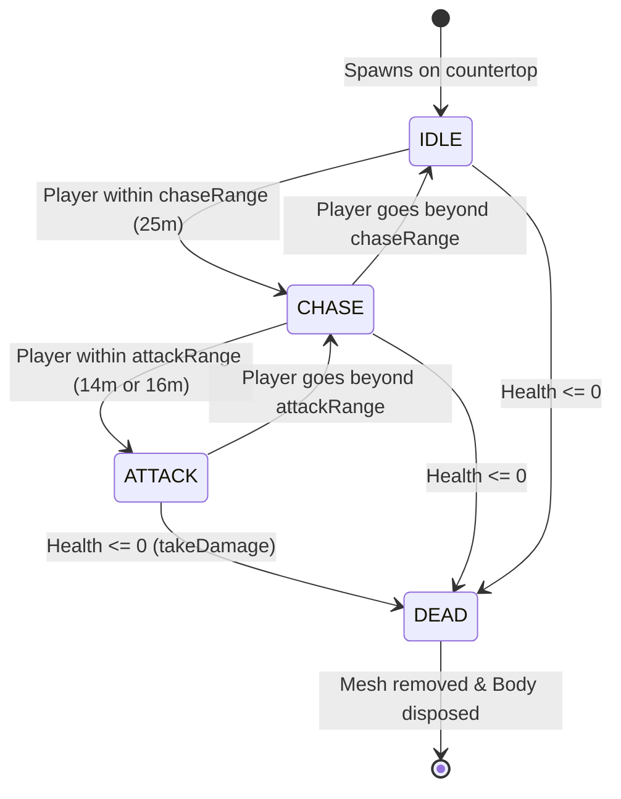

# NPC Engine: Architectural Design

This document details the architectural design, behavior FSM, and physics scaling of the hostile veggie enemies (Broccoli Boys and Carrot Cartel) in the Potato Gang arena.

---

## 🤖 1. Enemy Factions & Characteristics

Hostile NPCs are divided into two main syndicates:
1.  **Broccoli Boys (Green Faction)**: 
    *   **Geometry**: Composed of a brownish trunk/stalk (`CylinderGeometry`) topped by 3 deep green clustered spheres (`SphereGeometry`) and glowing red eyes.
    *   **Health**: `40` HP.
    *   **Movement**: Swift chasers (`speed = 4.5`). Charges the player directly.
    *   **Range**: Close combat fire (`attackRange = 14m`).
2.  **Carrot Cartel (Orange Faction)**:
    *   **Geometry**: Composed of an elongated cone pointing downwards (`ConeGeometry`), leaf tops (`CylinderGeometry`), and white eyes with black pupils.
    *   **Health**: `50` HP.
    *   **Movement**: Strategic snipers (`speed = 5.5`).
    *   **Range**: Extended sniper fire (`attackRange = 16m`).

---

## 🔄 2. Finite State Machine (FSM) Logic

Every frame, the `NpcEngine` updates the states of all active NPCs:

### State Behaviors
*   **`IDLE`**: Floating gently. Compensates for gravity and applies a soft sinusoidal vertical hover force. Slowly drifts back to its original spawn point if dragged away.
*   **`CHASE`**: Computes direction vector to player. Applies direct horizontal thruster forces to drive towards player, while applying dynamic gravity compensation to maintain height.
*   **`ATTACK`**: Damps horizontal velocity (`* 0.88` per frame) to halt movement and hover in place. Fires a bullet (tomato seed/orange dart) at the player according to its `fireRate` interval.
*   **`DEAD`**: Disposes of visual meshes, unregisters physics bodies, triggers juice splatters, and spawns the next wave when all NPCs are dead.

---

## 🌌 3. Physics & Gravity Scaling

To support both low-gravity and Earth gravity (`9.8 m/s²`), the upward hover forces are computed dynamically using:
$$\text{UpwardForce} = \text{mass} \times \text{gravity}$$

For an NPC with mass $15\,\text{kg}$ under Earth gravity ($9.8\,\text{m/s}^2$), this yields:
$$\text{GravityForce} = 15 \times 9.8 = 147\,\text{Newtons}$$

This ensures that the NPC levitates smoothly and floats in the air regardless of whether the world gravity is configured to `0.8` or `9.8`.

---

## 🧪 4. Testing Guidelines

### Unit Tests
*   Verify NPC initialization and stats in a test context.
*   Assert default values for faction, speed, ranges, and health.

### Manual Verification
1.  Open the developer debug panel (`F3` or `KeyH`).
2.  Press **Spawn Broccoli** or **Spawn Carrot** in the sandbox tab.
3.  Verify the NPC spawns flat on the countertop deck at `y = -4.15` (Broccoli) or `y = -3.75` (Carrot) before beginning its hover loop.
4.  Stand within `25m` to trigger the `CHASE` FSM state.
5.  Check that the NPC shoots back when within its attack range.
